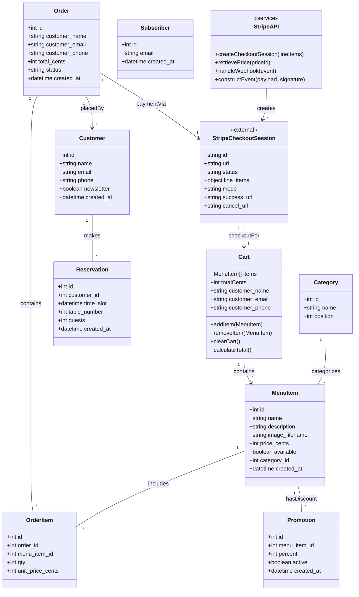
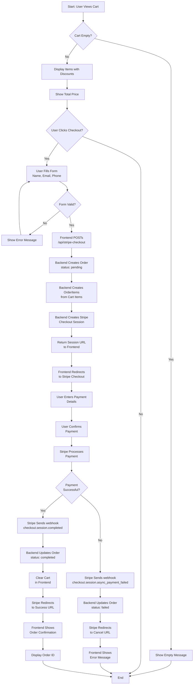
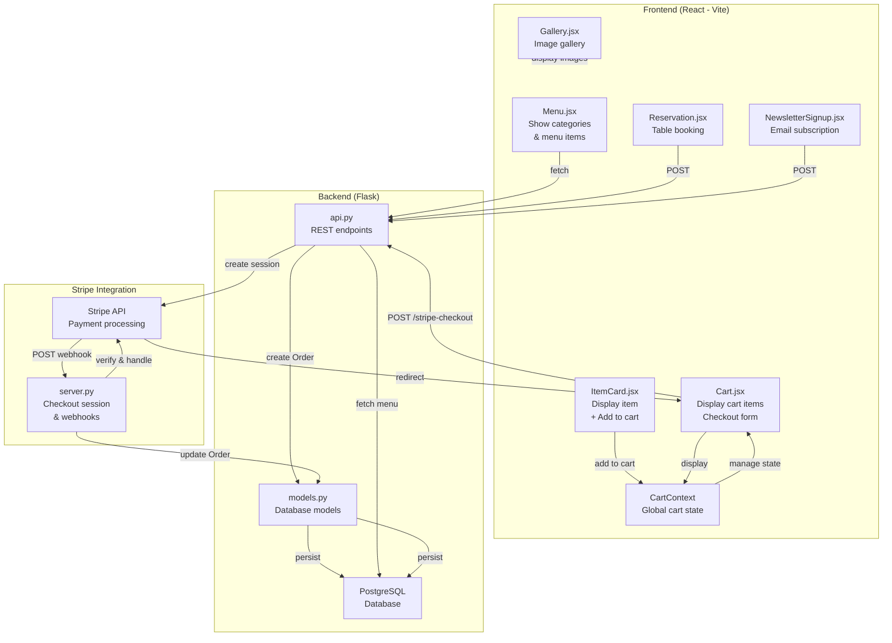

# Complete UML Diagrams - Mermaid Code Reference

## Overview
This document contains all Mermaid diagram codes for the Online Shop System with Stripe integration. Use these codes to:
- Copy into [Mermaid Live Editor](https://mermaid.live/)
- Generate PNG/SVG files using mermaid-cli
- Integrate into documentation
- View in VS Code with Mermaid extensions

---

## 1. CLASS DIAGRAM - System Architecture

**Description:** Shows all database models, their attributes, methods, and relationships.



### Key Relationships:
- **Category** (1) → (many) **MenuItem** - Categories contain menu items
- **MenuItem** (1) → (many) **OrderItem** - Items can be ordered multiple times
- **Order** (1) → (many) **OrderItem** - Orders contain multiple items
- **Order** (1) → (1) **Customer** - Each order belongs to a customer
- **Order** (1) → (1) **StripeCheckoutSession** - Orders have payment sessions
- **Cart** (client-side) - Temporary shopping cart before checkout

---

## 2. SEQUENCE DIAGRAM - Checkout Flow

**Description:** Timeline of interactions during the complete checkout process from add-to-cart to order confirmation.

```mermaid
sequenceDiagram
    actor User
    participant Frontend as Frontend<br/>(React)
    participant Backend as Backend<br/>(Flask API)
    participant StripeServer as Stripe Server<br/>(server.py)
    participant StripeAPI as Stripe API
    participant Database as PostgreSQL

    User->>Frontend: Add items to cart
    Frontend->>Frontend: Calculate total & discounts
    
    User->>Frontend: Enter name, email, phone
    User->>Frontend: Click "Checkout"
    
    Frontend->>Backend: POST /api/stripe-checkout
    activate Backend
    
    Note over Backend: Validate cart items
    Note over Backend: Create Order (status: pending)
    
    Backend->>Database: Save Order
    Backend->>Database: Save OrderItems
    Database-->>Backend: Order ID
    
    Backend->>StripeAPI: stripe.checkout.Session.create()
    activate StripeAPI
    StripeAPI-->>Backend: Checkout Session + URL
    deactivate StripeAPI
    
    Backend-->>Frontend: Return session URL
    deactivate Backend
    
    Frontend->>StripeAPI: Redirect to checkout.stripe.com
    activate StripeAPI
    
    User->>StripeAPI: Enter payment details
    User->>StripeAPI: Confirm payment
    
    alt Payment Success
        StripeAPI->>StripeAPI: Process payment
        StripeAPI->>StripeServer: POST /api/webhook
        activate StripeServer
        
        Note over StripeServer: Verify signature
        Note over StripeServer: Handle checkout.session.completed
        
        StripeServer->>Database: Update Order status = "completed"
        Database-->>StripeServer: OK
        
        StripeServer-->>StripeAPI: Return 200 success
        deactivate StripeServer
        
        StripeAPI->>Frontend: Redirect to success URL
        deactivate StripeAPI
        
        Frontend->>User: Show order confirmation
    else Payment Failed
        StripeAPI->>StripeServer: POST /api/webhook
        activate StripeServer
        
        Note over StripeServer: Handle checkout.session.async_payment_failed
        
        StripeServer->>Database: Update Order status = "failed"
        
        StripeServer-->>StripeAPI: Return 200 success
        deactivate StripeServer
        
        StripeAPI->>Frontend: Redirect to cancel URL
        deactivate StripeAPI
        
        Frontend->>User: Show error message
    end
```

### Key Interactions:
1. **Cart Phase** - User adds items and enters info
2. **Order Creation** - Backend creates order in database
3. **Stripe Session** - Backend requests payment session
4. **Payment** - User enters card details on Stripe
5. **Webhook** - Stripe notifies backend of result
6. **Confirmation** - User sees success or error message

---

## 3. ACTIVITY DIAGRAM - Order Processing Flow

**Description:** Step-by-step flowchart showing all decision points and actions in the order process.



### Decision Points:
- **Cart Empty?** - Check if items exist
- **User Clicks Checkout?** - Explicit action required
- **Form Valid?** - Validate customer info
- **Payment Successful?** - Stripe result determines path

---

## 4. COMPONENT DIAGRAM - System Architecture

**Description:** Shows how different system components interact with each other.



### Component Groups:
- **Frontend** - React components for user interface
- **Backend** - Flask API and database models
- **Stripe** - Payment processing and webhook handling

---

## Export to PNG Instructions

### Method 1: Mermaid Live Editor (Easiest)
1. Visit https://mermaid.live/
2. Copy any diagram code above
3. Paste into the editor
4. Click "Download" → "PNG"

### Method 2: Command Line (mermaid-cli)
```bash
# Install mermaid-cli
npm install -g @mermaid-js/mermaid-cli

# Convert each diagram
mmdc -i class_diagram.mmd -o class_diagram.png
mmdc -i sequence_checkout_flow.mmd -o sequence_checkout_flow.png
mmdc -i activity_checkout_flow.mmd -o activity_checkout_flow.png
mmdc -i component_interaction_diagram.mmd -o component_interaction_diagram.png
```

### Method 3: VS Code
1. Install "Markdown Preview Mermaid Support" extension
2. Open any .md file with mermaid code
3. Right-click → "Open Preview"
4. Right-click diagram → "Export as PNG"

### Method 4: HTML Viewer
Use the included `diagrams.html` file - open in browser and click download buttons

---

## Legend & Notation

### Class Diagram:
- `--` : Association (relationship)
- `|--` : Inheritance
- `*--` : Aggregation
- `o--` : Composition
- `"1"` : One (cardinality)
- `"*"` : Many (cardinality)

### Sequence Diagram:
- `→` : Synchronous call
- `-->` : Return/response
- `activate/deactivate` : Shows participant is active
- `alt/else` : Alternative flows
- `Note` : Commentary

### Activity Diagram:
- `[ ]` : Decision point
- `→` : Flow direction
- `◇` : Choice diamond
- `|` : Merge point

---

## File Structure

```
docs/
├── README_DIAGRAMS.md          (This file - complete reference)
├── diagrams.html               (Interactive HTML viewer)
├── class_diagram.md            (Class diagram markdown)
├── sequence_checkout_flow.md   (Sequence diagram markdown)
├── activity_checkout_flow.md   (Activity diagram markdown)
├── component_interaction_diagram.md  (Component diagram markdown)
└── diagrams/
    ├── class_diagram.mmd
    ├── sequence_checkout_flow.mmd
    ├── activity_checkout_flow.mmd
    └── component_interaction_diagram.mmd
```

---

**Generated:** January 22, 2026  
**System:** Online Shop with Stripe Integration  
**Technology:** Mermaid.js, React, Flask, PostgreSQL, Stripe API
