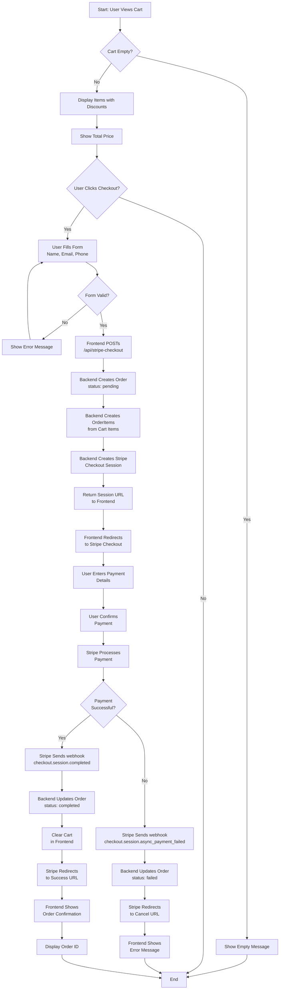

# Activity Diagram - Checkout and Order Processing

```mermaid
graph TD
    A["Start: User Views Cart"] --> B{Cart Empty?}
    B -->|Yes| C["Show Empty Message"]
    C --> Z["End"]
    
    B -->|No| D["Display Items with Discounts"]
    D --> E["Show Total Price"]
    E --> F{User Clicks Checkout?}
    
    F -->|No| Z
    
    F -->|Yes| G["User Fills Form<br/>Name, Email, Phone"]
    G --> H{Form Valid?}
    
    H -->|No| I["Show Error Message"]
    I --> G
    
    H -->|Yes| J["Frontend POSTs<br/>/api/stripe-checkout"]
    J --> K["Backend Creates Order<br/>status: pending"]
    
    K --> L["Backend Creates OrderItems<br/>from Cart Items"]
    L --> M["Backend Creates Stripe<br/>Checkout Session"]
    
    M --> N["Return Session URL<br/>to Frontend"]
    N --> O["Frontend Redirects<br/>to Stripe Checkout"]
    
    O --> P["User Enters Payment<br/>Details"]
    P --> Q["User Confirms<br/>Payment"]
    
    Q --> R["Stripe Processes<br/>Payment"]
    R --> S{Payment<br/>Successful?}
    
    S -->|No| T["Stripe Sends webhook<br/>checkout.session.async_payment_failed"]
    T --> U["Backend Updates Order<br/>status: failed"]
    U --> V["Stripe Redirects<br/>to Cancel URL"]
    V --> W["Frontend Shows<br/>Error Message"]
    W --> Z
    
    S -->|Yes| X["Stripe Sends webhook<br/>checkout.session.completed"]
    X --> Y["Backend Updates Order<br/>status: completed"]
    Y --> AA["Clear Cart<br/>in Frontend"]
    AA --> AB["Stripe Redirects<br/>to Success URL"]
    AB --> AC["Frontend Shows<br/>Order Confirmation"]
    AC --> AD["Display Order ID"]
    AD --> Z

```
