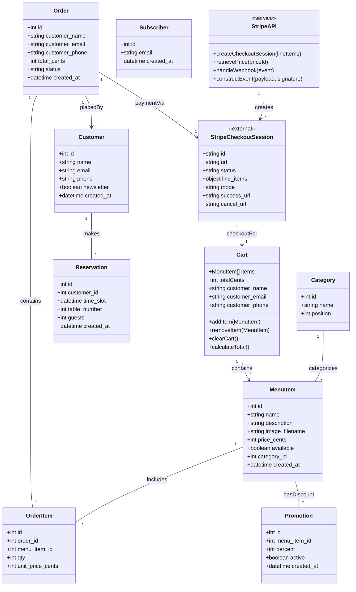

# Class Diagram - Online Shop System

```mermaid
classDiagram
    direction TB

    class Category {
        +int id
        +string name
        +int position
    }

    class MenuItem {
        +int id
        +string name
        +string description
        +string image_filename
        +int price_cents
        +boolean available
        +int category_id
        +datetime created_at
    }

    class Order {
        +int id
        +string customer_name
        +string customer_email
        +string customer_phone
        +int total_cents
        +string status
        +datetime created_at
    }

    class OrderItem {
        +int id
        +int order_id
        +int menu_item_id
        +int qty
        +int unit_price_cents
    }

    class Customer {
        +int id
        +string name
        +string email
        +string phone
        +boolean newsletter
        +datetime created_at
    }

    class Reservation {
        +int id
        +int customer_id
        +datetime time_slot
        +int table_number
        +int guests
        +datetime created_at
    }

    class Promotion {
        +int id
        +int menu_item_id
        +int percent
        +boolean active
        +datetime created_at
    }

    class Subscriber {
        +int id
        +string email
        +datetime created_at
    }

    class StripeCheckoutSession {
        <<external>>
        +string id
        +string url
        +string status
        +object line_items
        +string mode
        +string success_url
        +string cancel_url
    }

    class Cart {
        +MenuItem[] items
        +int totalCents
        +string customer_name
        +string customer_email
        +string customer_phone
        +addItem(MenuItem)
        +removeItem(MenuItem)
        +clearCart()
        +calculateTotal()
    }

    class StripeAPI {
        <<service>>
        +createCheckoutSession(lineItems)
        +retrievePrice(priceId)
        +handleWebhook(event)
        +constructEvent(payload, signature)
    }

    Category "1" -- "*" MenuItem: categorizes
    MenuItem "1" -- "*" OrderItem: includes
    Order "1" -- "*" OrderItem: contains
    MenuItem "1" -- "*" Promotion: hasDiscount
    Customer "1" -- "*" Reservation: makes
    Order "1" --> "1" Customer: placedBy
    Cart "1" --> "*" MenuItem: contains
    StripeCheckoutSession "1" --> "1" Cart: checkoutFor
    StripeAPI "1" --> "*" StripeCheckoutSession: creates
    Order "1" --> "1" StripeCheckoutSession: paymentVia

```
