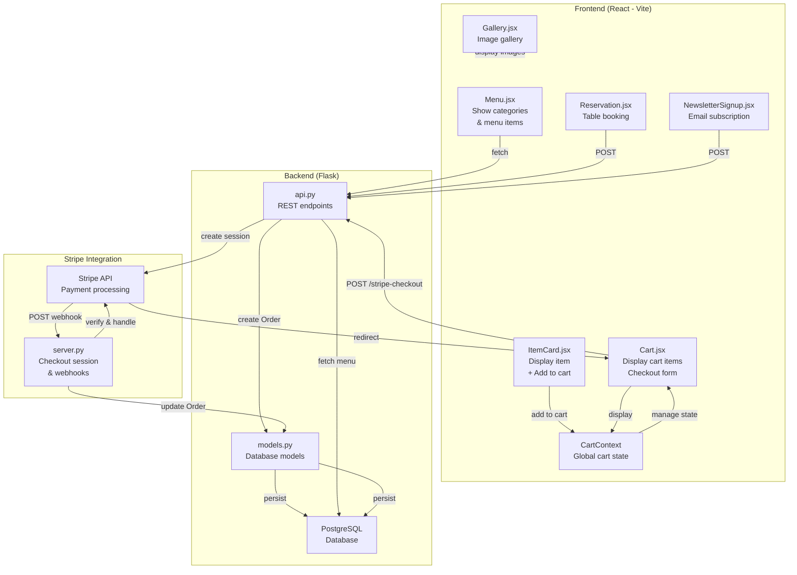

# Component Interaction Diagram

```mermaid
graph TB
    subgraph Frontend["Frontend (React - Vite)"]
        Menu["Menu.jsx<br/>Show categories<br/>& menu items"]
        ItemCard["ItemCard.jsx<br/>Display item<br/>+ Add to cart"]
        Cart["Cart.jsx<br/>Display cart items<br/>Checkout form"]
        Reservation["Reservation.jsx<br/>Table booking"]
        Gallery["Gallery.jsx<br/>Image gallery"]
        NewsletterSignup["NewsletterSignup.jsx<br/>Email subscription"]
        CartContext["CartContext<br/>Global cart state"]
    end
    
    subgraph Backend["Backend (Flask)"]
        API["api.py<br/>REST endpoints"]
        Models["models.py<br/>Database models"]
        DB["PostgreSQL<br/>Database"]
    end
    
    subgraph Stripe["Stripe Integration"]
        StripeServer["server.py<br/>Checkout session<br/>& webhooks"]
        StripeAPI["Stripe API<br/>Payment processing"]
    end
    
    Menu -->|fetch| API
    ItemCard -->|add to cart| CartContext
    Cart -->|display| CartContext
    Cart -->|POST /stripe-checkout| API
    
    API -->|create Order| Models
    Models -->|persist| DB
    
    API -->|fetch menu| DB
    API -->|create session| StripeAPI
    
    StripeAPI -->|redirect| Cart
    StripeAPI -->|POST webhook| StripeServer
    StripeServer -->|verify & handle| StripeAPI
    StripeServer -->|update Order| Models
    Models -->|persist| DB
    
    Reservation -->|POST| API
    NewsletterSignup -->|POST| API
    Gallery -->|display images| Frontend
    
    CartContext -->|manage state| Cart

```
